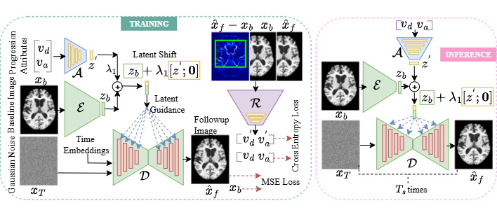

# AD-DAE: Alzheimer’s Disease Progression Modeling with Unpaired Longitudinal MRI using Diffusion Auto-Encoders

## Architecture


> Figure: High-level schematic of the AD-DAE framework showing the encoder-guided diffusion decoder, latent shift estimation, and consistency guidance.

## Inference
- A walkthrough notebook is provided: **`Inference_AD_DAE.ipynb`**  
- It demonstrates:
  - Loading a trained AD-DAE checkpoint
  - Loading a 3D .nii file and generating .h5
  - Dataloading from .h5 files
  - Encoding a baseline scan
  - Estimating latent shifts from progression attributes (age, cognitive status)
  - Generating follow-up images via the diffusion decoder
  - Optional evaluation/visualization steps
  
## Installations
### 🐳 Docker Base Image

This project is built on top of the MONAI Toolkit images:

```dockerfile
FROM nvcr.io/nvidia/clara/monai-toolkit:2.2
```


## 🧠 Dataset

We utilize **longitudinal brain MRI scans** from the following publicly available repositories:

- **Alzheimer’s Disease Neuroimaging Initiative (ADNI)**  
  [https://adni.loni.usc.edu/](https://adni.loni.usc.edu/)  
  Subjects include three cognitive statuses: *Cognitively Normal (CN)*, *Mild Cognitive Impairment (MCI)*, and *Alzheimer’s Disease (AD)*.

- **Open Access Series of Imaging Studies (OASIS)**  
  [https://www.oasis-brains.org/](https://www.oasis-brains.org/)  

All selected images are **T1-weighted 3D structural MRIs**.


