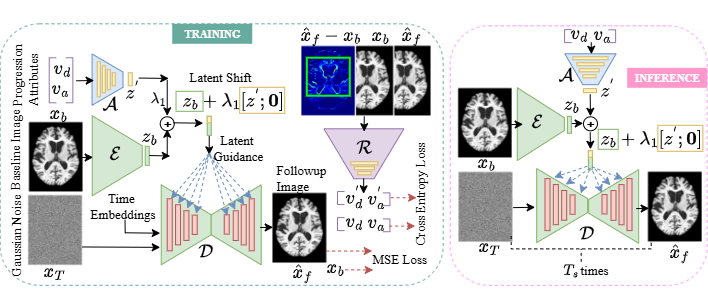

<div align="center">

# AD-DAE
### Alzheimer's Disease Progression Modeling with Unpaired Longitudinal MRI using Diffusion Auto-Encoders

[](https://ieeexplore.ieee.org/abstract/document/11579738)
[](https://arxiv.org/abs/2511.05934)
[](https://www.python.org/)
[](https://pytorch.org/)
[](https://monai.io/)
[](#license)

📄 **Paper:** [IEEE JBHI](https://ieeexplore.ieee.org/abstract/document/11579738) &nbsp;|&nbsp; [arXiv:2511.05934](https://arxiv.org/abs/2511.05934)

</div>

AD-DAE is a diffusion-autoencoder framework for modeling **Alzheimer's Disease (AD) progression** directly from **unpaired, longitudinal 3D brain MRI**. Instead of requiring matched baseline/follow-up scan pairs, AD-DAE learns a semantic latent space in which disease progression is represented as a **latent shift**, conditioned on clinical attributes (e.g., age, cognitive status). A diffusion decoder then renders realistic follow-up scans consistent with the estimated trajectory, enabling counterfactual and longitudinal simulation of neurodegeneration.

---

## Table of Contents
- [Highlights](#highlights)
- [Architecture](#architecture)
- [Installation](#installation)
- [Dataset](#dataset)
- [Repository Structure](#repository-structure)
- [Quickstart: Inference](#quickstart-inference)
- [Training](#training)
- [Results](#results)
- [Citation](#citation)
- [Acknowledgements](#acknowledgements)
- [License](#license)
- [Contact](#contact)

---

## Highlights
- 🧩 **Unpaired longitudinal modeling** — no need for perfectly registered baseline/follow-up scan pairs at train time.
- 🌀 **Diffusion auto-encoder backbone** — combines a semantic encoder with a DDIM-based diffusion decoder for high-fidelity 3D MRI synthesis.
- 🧭 **Latent shift estimation** — progression is modeled as a learned shift in latent space, conditioned on clinical/demographic attributes.
- 🧠 **Disease-aware evaluation** — supports ADNI's three cognitive-status cohorts (CN / MCI / AD) for stratified progression analysis.
- 📓 **Ready-to-run inference notebook** for loading checkpoints, encoding scans, and generating follow-up predictions end-to-end.

## Architecture


> High-level schematic of the AD-DAE framework: an encoder-guided diffusion decoder, latent shift estimation module, and consistency guidance jointly model disease progression trajectories in latent space.

Additional methodological details are provided in the [supplementary material](assets/AD_DAE_JBHI_Supplementary_Material.pdf).

---

## Installation

### 🐳 Docker (recommended)
This project is built on top of the MONAI Toolkit images:

```dockerfile
FROM nvcr.io/nvidia/clara/monai-toolkit:2.2
```

### 🔧 Manual setup
```bash
git clone https://github.com/ayantikadas/AD_DAE.git
cd AD_DAE

# Create and activate an environment (Python 3.8+ recommended)
conda create -n ad_dae python=3.8 -y
conda activate ad_dae

# Install PyTorch + core dependencies (adjust CUDA version as needed)
pip install torch torchvision pytorch-lightning monai omegaconf \
            nibabel opencv-python scikit-image tqdm pandas numpy matplotlib
```

> **Note:** This repo does not yet ship a pinned `requirements.txt`. If you hit version issues, match the MONAI Toolkit 2.2 base image's package versions above.

---

## Dataset

We utilize **longitudinal brain MRI scans** from the following publicly available repositories:

| Dataset | Description | Link |
|---|---|---|
| **ADNI** | Alzheimer's Disease Neuroimaging Initiative. Subjects span three cognitive statuses: *Cognitively Normal (CN)*, *Mild Cognitive Impairment (MCI)*, and *Alzheimer's Disease (AD)*. | [adni.loni.usc.edu](https://adni.loni.usc.edu/) |
| **OASIS** | Open Access Series of Imaging Studies. | [oasis-brains.org](https://www.oasis-brains.org/) |

All selected images are **T1-weighted 3D structural MRIs**. Access to ADNI/OASIS requires a data use agreement with the respective consortium — this repository does not redistribute any imaging data.

Expected local layout (see `dataset/ADNI_Data_loader_csv/` and `config_file_ADNI.yaml` for the exact manifest/CSV format):
```
data_store/
├── ADNI_ventricle_mask/
└── ADNI_cond_test_ventricle_mask/
```

---

## Repository Structure

```
AD_DAE/
├── AD_DAE_model_call.py     # Convenience loader: builds config + restores a trained checkpoint
├── experiment_ADNI.py       # PyTorch Lightning module, training loop, and train() entry point
├── templates.py             # Named model/training configs (e.g., AD_DAE_autoenc_130M)
├── config_ADNI.py           # TrainConfig / ModelConfig definitions
├── config_base.py           # Base configuration dataclasses
├── config_file_ADNI.yaml    # Dataloader/H5-cache configuration (paths, slicing, batch size)
├── choices.py                # Enums for model/loss/scheduler options
├── dataset/                  # ADNI/OASIS dataloaders and CSV manifests
├── diffusion/                 # Beta schedules, DDIM sampling, diffusion process utilities
├── model/                     # U-Net encoder/decoder, latent-shift predictor (LatentNet), blocks
├── data_store/                 # Cached H5 datasets (user-populated, not tracked)
├── Inference_AD_DAE.ipynb      # End-to-end inference walkthrough notebook
└── assets/                     # Architecture figure + supplementary material
```

---

## Quickstart: Inference

A walkthrough notebook is provided: **[`Inference_AD_DAE.ipynb`](Inference_AD_DAE.ipynb)**. It demonstrates:

1. Loading a trained AD-DAE checkpoint
2. Loading a 3D `.nii`/`.nii.gz` volume and converting it to the cached `.h5` format
3. Dataloading from `.h5` files
4. Encoding a baseline scan into the semantic latent space
5. Estimating latent shifts from progression attributes (age, cognitive status)
6. Generating follow-up images via the diffusion decoder
7. Optional evaluation/visualization steps (slice views, similarity metrics)

Minimal example (see the notebook for the full pipeline):
```python
import AD_DAE_model_call as model_call

model = model_call.AD_DAE_model_call_func(
    root_path="/path/to/AD_DAE_files/",
    checkpoint_path="/path/to/trained_checkpoint/",
)
```

---

## Training

Training configurations are defined as named presets in [`templates.py`](templates.py) (e.g., `AD_DAE_autoenc_130M`) and executed via the `train()` entry point in [`experiment_ADNI.py`](experiment_ADNI.py), which wraps a `pytorch_lightning.Trainer`.

```python
from templates import AD_DAE_autoenc_130M
from experiment_ADNI import train

conf = AD_DAE_autoenc_130M()
# adjust conf.batch_size, conf.data_config_path, conf.csv_path_test/train, etc.
train(conf, gpus=[0])
```

Update [`config_file_ADNI.yaml`](config_file_ADNI.yaml) and the CSV manifests in `dataset/ADNI_Data_loader_csv/` to point at your local ADNI/OASIS cache before training.

---

## Results
> _Add qualitative/quantitative results here (e.g., generated follow-up scans vs. ground truth, progression trajectory visualizations, SSIM/PSNR tables) once available for public release._

---

## Citation
If you use AD-DAE in your research, please cite our work:

```bibtex
@article{das_addae,
  title   = {AD-DAE: Alzheimer's Disease Progression Modeling with Unpaired Longitudinal MRI using Diffusion Auto-Encoders},
  author  = {Das, Ayantika and others},
  journal = {IEEE Journal of Biomedical and Health Informatics (JBHI)},
  year    = {2026},
  url     = {https://ieeexplore.ieee.org/abstract/document/11579738}
}

@article{das_addae_arxiv,
  title   = {AD-DAE: Alzheimer's Disease Progression Modeling with Unpaired Longitudinal MRI using Diffusion Auto-Encoders},
  author  = {Das, Ayantika and others},
  journal = {arXiv preprint arXiv:2511.05934},
  year    = {2025},
  url     = {https://arxiv.org/abs/2511.05934}
}
```
<!-- TODO: update author list and volume/pages once finalized in IEEE Xplore. -->

## Acknowledgements
- Built on top of the [MONAI](https://monai.io/) Toolkit and diffusion-autoencoder concepts popularized by [Diff-AE](https://github.com/phizaz/diffae) and [DDIM](https://arxiv.org/abs/2010.02502).
- Imaging data courtesy of the [ADNI](https://adni.loni.usc.edu/) and [OASIS](https://www.oasis-brains.org/) consortia.

## License
<!-- TODO: add a LICENSE file and reference it here (e.g., MIT, Apache-2.0). -->
License to be determined.

## Contact
For questions or issues, please open a [GitHub Issue](https://github.com/ayantikadas/AD_DAE/issues) or reach out to the repository maintainer.


